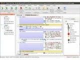

This is a small taste of what can be done with wxWidgets. You can also find
more screenshots on the [wxPython website][1].

[1]: http://wxpython.org/wxpshots.php

## BOINC

[BOINC][2] is software that uses the idle time on your computer (Windows, Mac,
or Linux) to cure diseases, study global warming, discover pulsars, and do many
other types of scientific research.

One project that uses BOINC is SETI@home, a scientific experiment that uses
Internet-connected computers in the Search for Extraterrestrial Intelligence
(SETI).

[2]: http://boinc.berkeley.edu/

<ul class="thumbnails">
  <li class="span2">
    
  </li>
</ul>

## SYSmark 2012

[SYSmark 2012]3] is an application-based benchmark that reflects usage patterns
of business users in the areas of office productivity, data/financial
analysis, system management, media creation, 3D modeling and web development.

[3]: http://www.bapco.com/products/sysmark-2012

<ul class="thumbnails">
  <li class="span2">
    
  </li>
</ul>

## Game Develop

[Game Develop][4] is game development software, using wxWidgets for all GUI
related tasks, allowing creation of any kind of 2D game without needing any
knowledge in a specific language. Everything is made using visual editors and
the software uses an event-based system, using conditions which have to be
filled so as to execute actions, to manage the game logic. These events are
compiled by Game Develop to machine code. Games can be compiled and distributed
for Windows and Ubuntu.

[4]: http://www.en.compilgames.net/

<ul class="thumbnails">
  <li class="span2">
    
  </li>
  <li class="span2">
    
  </li>
</ul>

