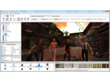
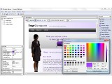

This is a small taste of some of the applications built with wxWidgets.

## Hollywood

  

    
  

  

    
  

[Hollywood][hollywood] is a cross-platform programming language available for
many different platforms. It comes with an inbuilt cross-compiler that can 
deploy executables to over 15 different architectures, ranging from AmigaOS
to Windows. Hollywood uses wxWidgets in its RapaGUI plugin which can be used to
conveniently create graphical user interfaces from XML files in a platform-independent way. 

[hollywood]: https://www.hollywood-mal.com/

## IvyBackup

  

    
  

[IvyBackup][ivybackup] is backup software for Windows that is easy and
intuitive to use. It saves you time, money and headaches. It protects your
files from total or partial loss and ensures your files and documents are
never left vulnerable.

[ivybackup]: https://www.ivybackup.com/

## CopperCube

  

    
  

  

    
  

[CopperCube][coppercube], by Ambiera, is an editor for creating 3D apps, games
and 3D websites. Import or create your 3D models, set camera controllers,
materials, behaviors, click 'publish' and your app is ready. Create everything
from simple model viewers to full 3D games as WebGL websites, Flash .swfs, Mac
OS, Windows, or Android apps, all without programming.

[coppercube]: http://www.ambiera.com/coppercube/

## RocketCake

  

    
  

[RocketCake][rocketcake], by Ambiera, is a free web editor for creating
responsive websites. For beginners and professional web developers. No
programming needed. Rocket Cake has built in support for all important HTML
elements: image galleries, slideshows, resizable containers, stylish buttons,
gradients, HTML 5 video, audio, and more.

[rocketcake]: http://www.ambiera.com/rocketcake/

## ZepMan

  

    
  

[ZepMan][zepman] is a front-end for the Zep experiment control program. The
application suite (ZepMan + Zep) is used by experimental psychologists for
scientific research (speech and language mainly). The application runs under
Linux, Windows and Mac OS X.

[zepman]: https://www.beexy.nl/zepman/

## Cars HotSurf

  

    
  

[Cars HotSurf][cars-hotsurf] finds used cars on popular car sales websites in
the United States and Europe. Cars HotSurf was specially developed for car
dealers and professional car resellers. It automatically monitors popular used
car sales websites for the latest cars offers according to user preferences.

[cars-hotsurf]: http://hotsurf.biz/

## ECMerge

  

    
  

  

    
  

  

    
  

[ECMerge][ecmerge] is a comparison, synchronization and merge tool. It is
advanced tool primarily targeted to the developer to compare source code,
images and trees of source, but it's interface is easy enough to use by
commercials and laywers to compare conracts. ECMerge runs on Linux, Mac and
Windows.

[ecmerge]: http://www.elliecomputing.com/

## Audacity

  

    
  

  

    
  

  

    
  

[Audacity][audacity] is a free, easy-to-use and multilingual audio editor and
recorder for Windows, Mac OS X, GNU/Linux and other operating systems. You can
use Audacity to record live audio, convert tapes and records into digital
recordings or CDs, edit sound files, cut/copy/splice or mix sounds together,
and change the speed or pitch of a recording.

[audacity]: http://audacity.sourceforge.net/

## Poedit

  

    
  

  

    
  

  

    
  

[Poedit][poedit] is cross-platform gettext catalogs editor for translators
which runs on Unix, Windows and Mac OS X. Unlike other editors, Poedit provides
compact view of data and very effective UI.

[poedit]: http://www.poedit.net/

## Transcribe!

  

    
  

  

    
  

  

    
  

[Transcribe!][transcribe] is an assistant for people who want to work out a
piece of music from a recording, in order to write it out, or play it
themselves, or both. It doesn't do the transcribing for you, but it is
essentially a specialised player program which is optimised for the purpose of
transcription. It has many transcription-specific features not found on
conventional music players.

[transcribe]: http://www.seventhstring.com/xscribe/overview.html

## BOINC

  

    
  

[BOINC][boinc] is software that uses the idle time on your computer (Windows,
Mac, or Linux) to cure diseases, study global warming, discover pulsars, and do
many other types of scientific research.

One project that uses BOINC is SETI@home, a scientific experiment that uses
Internet-connected computers in the Search for Extraterrestrial Intelligence
(SETI).

[boinc]: http://boinc.berkeley.edu/

## Game Develop

  

    
  

  

    
  

[Game Develop][gamedevelop] is game development software, using wxWidgets for
all GUI related tasks, allowing creation of any kind of 2D game without needing
any knowledge in a specific language. Everything is made using visual editors
and the software uses an event-based system, using conditions which have to be
filled so as to execute actions, to manage the game logic. These events are
compiled by Game Develop to machine code. Games can be compiled and distributed
for Windows and Ubuntu.

[gamedevelop]: http://www.en.compilgames.net/

## Audio Evolution

  

    
  

  

    
  

[Audio Evolution][audio-evolution], by eXtream Software Development, is a
multi-platform audio and MIDI sequencing application with a focus on
user-friendliness and simplicity. Compose your music using multi-channel
recording, mixing, non-destructive editing, real-time effects and a lot more
for a very affordable price!

[audio-evolution]: http://www.audio-evolution.com/

## Ginkgo CADx

  

    
  

[Ginkgo CADx][ginkgo], by MetaEmotion S.L., is a multi-platform Open Source
Medical Imaging Software which provides a complete DICOM Viewer solution with
advanced capabilities and extensions support. Ginkgo CADx works on Windows,
Linux and MacOS X.

[ginkgo]: http://ginkgo-cadx.com/en/

## GIMIAS

  

    
  

  

    
  

  

    
  

[GIMIAS][gimias] is a workflow-oriented environment focused on biomedical image
computing and simulation. The open source framework is extensible through
plug-ins and is focused on building research and clinical software prototypes.
Gimias has been used to develop clinical prototypes in the fields of cardiac
imaging and simulation, angiography imaging and simulation, and neurology.

[gimias]: http://www.gimias.org/

## SYSmark 2012

  

    
  

[SYSmark 2012][sysmark2012] is an application-based benchmark that reflects
usage patterns of business users in the areas of office productivity,
data/financial analysis, system management, media creation, 3D modeling and web
development.

[sysmark2012]: http://www.bapco.com/products/sysmark-2012

## WebsitePainter

  

    
  

  

    
  

[WebsitePainter][websitepainter] is a web editor for creating professional
looking Websites, without HTML knowledge and programming. With a few clicks it
is possible to create web pages with elements like Web2.0 buttons, gradients,
round borders, hover effects, transparencies, continuous text and more.
WebsitePainter works on Windows and Mac OS X.

[websitepainter]: http://www.ambiera.com/websitepainter/index.html

## Trident

  

    
  

  

    
  

  

    
  

Trident, by [USCS][trident], is designed as a satellite application to the
CADDS-5 system, as well as operating as a standalone program, to be used in
shipbuilding. It is a modularized application, running on Win32, Solaris and
Linux platforms. Presently there are 3 working modules: paint area estimation,
hull draw generation, and CADDS-5 hiding procedure editor.

[trident]: http://www.uscs.hr/

## Kirix Strata

  

    
  

  

    
  

[Kirix Strata][kirix] is an ad hoc data analysis and reporting tool for
business analysts and IT workers. Strata enables you to explore and work with
structured data much more effectively than with common data tools like
spreadsheets and desktop databases. With Strata, you can access data from just
about anywhere (including the Web), work with unlimited file sizes, and use a
wealth of analytic tools to quickly accomplish your tasks.

[kirix]: http://www.kirix.com/

## Caedium

  

    
  

  

    
  

  

    
  

Symscape's [Caedium][caedium] provides an affordable, unified simulation
environment for 3D fluid flow analysis and visualization on Windows, Macintosh,
and Linux. Caedium uses state-of-the-art Computational Fluid Dynamics (CFD) to
simulate the fluid flow and heat transfer over almost any configuration.
Caedium combines intuitive drag and drop model configuration with affordable
pricing and free trials, bringing CFD within the reach of everyone.

[caedium]: http://www.symscape.com/product/symlab

## KiCad

  

    
  

  

    
  

[KiCad][kicad] is an open source (GPL) application for designing electronic
schematic diagrams and printed circuit board artwork. Available for Windows and
Linux.

[kicad]: http://iut-tice.ujf-grenoble.fr/kicad/index.html

## Kephra

  

    
  

[Kephra][kephra] is a programmer's GUI text editor which is based on Scintilla
and written in Perl, using the wxPerl bindings. The interface is designed along
the Perl principles "there is more than one way to do it" and "keep easy things
easy and the hard possible". It runs on Linux, Mac and Windows.

[kephra]: http://kephra.sourceforge.net/

## Writer's Café

  

    
  

  

    
  

[Writer's Café][storylines] is a set of power tools for all fiction writers,
whether experienced or just starting out. The heart of Writer's Café is
StoryLines, a powerful but simple to use story development tool that
dramatically accelerates the creation and structuring of your novel or
screenplay.

[storylines]: http://www.writerscafe.co.uk/
