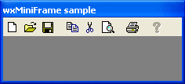

Errors will be corrected in future reprints. Please report errors to Julian
Smart at <julian@anthemion.co.uk>.

**Error on P. xii**

At the top of the page, the page reference "31" should read "131".

**Error on P. 1** Reported 2006-09-21

At the end of the first paragraph, "available parts" should read "available
ports".

**Error on P. 52**

In the text: "SetOwnForegroundColour is the same as SetOwnForegroundColour but
the color is not inherited by the window's child", the second
SetOwnForegroundColour should be "SetForegroundColour".

**Error on P. 63**

Figure 4-5 repeats the MDI screenshot from Figure 4-6, and should instead show
the following picture.

**Error on P. 72**

In the example code for the wxPanel, this code:

    wxPanel* panel = new wxPanel(frame, wxID_ANY,
        wxDefaultPosition, (500,300));

should read:

    wxPanel* panel = new wxPanel(frame, wxID_ANY,
        wxDefaultPosition, wxSize(500,300));

**Error on P. 73**

This example:

    wxNotebook *notebook = new wxNotebook(this, wxID_ANY, wxDefaultPosition, wxDefaultSize);

    wxImageList *imageList = new wxImageList(16,16,true, 3);
    imageList->Add(wxIcon(copy_xpm));
    imageList->Add(wxIcon(paste_xpm));
    imageList->Add(wxIcon(cut_xpm));

    wxPanel1 *window1 = new wxPanel(notebook, wxID_ANY);
    wxPanel2 *window2 = new wxPanel(notebook, wxID_ANY);
    wxPanel3 *window3 = new wxPanel(notebook, wxID_ANY);

    notebook->AddPage(window1, wxT("Tab One"), true,0);
    notebook->AddPage(window2, wxT("Tab two"), false,1);
    notebook->AddPage(window3, wxT("Tab three"), false,2);

should instead read:

    wxImageList *imageList = new wxImageList(16,16,true, 3);
    imageList->Add(wxIcon(copy_xpm));
    imageList->Add(wxIcon(cut_xpm));
    imageList->Add(wxIcon(paste_xpm));
    notebook->SetImageList(imageList);

    wxPanel *window1 = new wxPanel(notebook, wxID_ANY);
    wxPanel *window2 = new wxPanel(notebook, wxID_ANY);
    wxPanel *window3 = new wxPanel(notebook, wxID_ANY);

    notebook->AddPage(window1, wxT("Tab One"), true,0);
    notebook->AddPage(window2, wxT("Tab two"), false,1);
    notebook->AddPage(window3, wxT("Tab three"), false,2);

(remove numbering from wxPanel1, wxPanel2, and wxPanel3, add a SetImageList
call, switch the ordering of the paste_xpm and cut_xpm lines to match the
ordering of the tab icons in Figure 4-9, and add a comma between "false" and
"2" on the last line.)

**Error on P. 77**

In the first example, the lines

    int pixelsPerUnixX = 10;
    int pixelsPerUnixY = 10;

should read:

    int pixelsPerUnitX = 10;
    int pixelsPerUnitY = 10;

(change Unix to Unit).

**Error on P. 94** Reported 2007-11-20

In the example at the top of the page, `wxCheckBox* checkbox` should read
`wxCheckBox* checkBox` (captialise the 'b').

**Error on P. 101**

Just after the radio button code example, the reference should be to Figure
4-21 and not 4-22 (which is a scrollbar).

**Error on P. 109** Reported 2006-09-25

On the second to last line in the example near the top of the page, there is a
missing closing parenthesis after `*wxBLUE`. So it should read:

    text->SetDefaultStyle(wxTextAttr(*wxBLUE));

**Error on P. 122** Reported 2007-12-30

In the wxMenuBar example, the line

    menuBar->Append(fileMenu);

should be replaced by

    menuBar->Append(fileMenu, wxT("&File"));

(the menu title was missing).

**Error on P. 132** Reported 2007-12-11

On the first row below Table 5-1, "SetUser Scale" should read "SetUserScale".

**Error on P. 136**

In the code example, last line before the right brace,
`DrawRectangle(rectToDraw);` should read `dc.DrawRectangle(rectToDraw);`.

**Error on P. 139** Reported 2007-12-11

In the second paragraph of section "Printing with wxPrinterDC ...", "You can
pass it a wxPrintData after setting paper type, ..." should read "You can pass
it a wxPrintData object after setting paper type, ..." (missing "object").

**Error on P. 141** Reported 2006-09-21

In the last paragraph, ninth line from the bottom, "dark slate gray dark
turquoise" is missing a comma and should read "dark slate gray, dark
turquoise".

**Error on P. 141** Reported 2007-08-7

In second code example, in the last line, wxString should be replaced by
wxColour, i.e.:

    wxColour color = wxTheColourDatabase->Find(name);

**Error on P. 151**

In DrawRotatedText, `dc.SetTextForeground(wxBLACK);` should read
`dc.SetTextForeground(*wxBLACK);` (insert a missing asterisk).

**Error on P. 152** Reported 2007-12-11

In the last statement of the first code example, "msg" should be replaced by
"text".

**Error on P. 154** Reported 2006-09-21, re-reported 2007-12-11 as the
original erratum was wrong

In the second to last line, `pt.x` should read `points[i].x` and `pt.y` should
read `points[i].y`.

**Error on P. 156**

In the comment: "3-point sline" should read "3-point spline".

**Error on P. 158** Reported 2009-03-10

Replace these lines in the code sample (last two lines):

    dcDest.SelectBitmap(wxNullBitmap);
    dcSource.SelectBitmap(wxNullBitmap);

with:

    dcDest.SelectObject(wxNullBitmap);
    dcSource.SelectObject(wxNullBitmap);

**Error on P. 159** Reported 2006-09-21

"// Draw a green rectangle outlines in red" should read "// Draw a green
rectangle outlined in red" (change "outlines" to "outlined").

Also, the spacing in the example is wrong, and should be:

    // Draw a green rectangle outlined in red
    dc.SetPen(*wxRED_PEN);

    dc.SetBrush(*wxGREEN_BRUSH);
    dc.DrawRectangle(10, 10, 100, 100);

    // Now fill the green area with black (while green is found)
    dc.SetBrush(*wxBLACK_BRUSH);
    dc.FloodFill(50, 50, *wxGREEN, wxFLOOD_SURFACE);

    // Then fill with blue (until red is encountered)
    dc.SetBrush(*wxBLUE_BRUSH);
    dc.FloodFill(50, 50, *wxRED, wxFLOOD_BORDER);

**Error on P. 161** Reported 2007-12-11

In the last statement of the code example, `(*g_printDialogData)` should read
`g_printDialogData` (remove asterisk and parentheses: `g_printDialogData` is a
global object, not a pointer; the parentheses are unnecessary).

**Error on P. 165/166** Reported 2007-12-11

Replace `wxDC *dc` with `wxDC& dc` in the argument to `MyPrintout::DrawPageOne`
on the first line, and replace all 3 occurrences of `dc->` with `dc.`

**Error on P. 172**

In the first entry of Table 6-1, the first two letters (EV) should be in the
same font as the rest of the word. There is also a missing `)` after
`EVT_LEFT_DOWN(func`.

**Error on P. 177** Reported 2007-12-11

In Table 6-3, the right column should end with an empty cell below the last
item. Also, the last cell in the left column should have the same height as the
other cells.

**Error on P. 179**

The text `ASCII "A" (65) and ASCII A (97)` should read `ASCII "A" (65) and
ASCII "a" (97)`.

**Error on P. 187** Reported 2006-09-22

On the 7th line, change "näive" to "naïve" (dieresis should be on the "i" not
the "a").

**Error on P. 215** Reported 2007-04-30

In the table at the top of the page, replace `wxFILE_MUST_EXIT` with
`wxFILE_MUST_EXIST` (add the missing 's').

**Error on P. 216** Reported 2006-10-30

In the first line, remove the second closing parenthesis.

**Error on P. 244** Reported 2006-09-25

The second line of code should be aligned as per the third line (missing
space).

**Error on P. 247**

Replace `ID_SAGE` with `ID_AGE` in two instances of `FindWindow(ID_SAGE)`.

**Error on P. 248**

In the following text on the second half of the page:

"We need to dig a bit deeper into how wxWidgets handles validators in order to
understand what's going on here. As we've seen, the default OnOK handler calls
TransferDataToWindow, but before it does so, it calls Validate, vetoing the
calls to TransferDataToWindow"

replace both references to `TransferDataToWindow` with `TransferDataFromWindow`.

**Error on P. 273**

On the fifth line in the code example, this line:

    // Method 2: load from an ICO resource (Window and OS/2 only)

should be:

    // Method 2: load from an ICO resource (Windows and OS/2 only)

(replace "Window" with "Windows").

**Error on P. 277 and P. 278** Reported 2006-09-01

All occurrences of `SetOptionInt` should be replaced by `SetOption`.

**Error on P. 278 and P. 279** Reported 2006-09-25

`wxCURSOR_WE` should read `wxCURSOR_SIZEWE` on P. 278, sixth row of the
paragraph headed "Using wxSetCursorEvent", and also P. 279 on the fourth line
of the first paragraph.

**Error on P. 284**

Rotate takes several arguments, not just one, so in the example, replace the
line:

    wxImage image2 = image1.Rotate(0.5);

with:

    wxImage image2 = image1.Rotate(0.5, wxPoint(100, 100));

**Error on P. 354** Reported 2006-09-25

"wxTaskBarIconSample" should read "wxTaskBarIcon Sample" (fourth line from the
bottom).

**Error on P. 354** Reported 2006-09-25

On the third line from the bottom, "Selecting" should not be in italics, i.e.
it should read "Selecting *Set New Icon*".

**Error on P. 386** Reported 2007-01-23

In the example, the line "This macro declares and implements CustomerList as a
hash map" should be replaced by "This macro declares and implements
CustomerHash".

**Error on P. 392** Reported 2006-09-28

In the section wxPoint and wxRealPoint, the double minus should be replaced
with a single minus in both cases.

**Error on P. 398**

In the example 7 lines from the bottom, `fileMsg.Read` should be `file.Read`.

**Error on P. 408** Reported 2008-10-23

Should change zip to in the second line of the code:

    // Method 2: specify the archived file in the constructor
    wxZipInputStream in(wxT("test.zip"), wxT("text.txt"));
    wxTextInputStream txt(zip);
    wxString data;
    txt >> data;

should read:

    wxZipInputStream in(wxT("test.zip"), wxT("text.txt"));
    wxTextInputStream txt(in);
    wxString data;
    txt >> data;

**Error on P. 434** Reported 2007-02-01

On the last line, the web site address `www.poedit.org` should be
`www.poedit.net`.

**Error on P. 441** Reported 2007-12-11

Three lines before the heading "Converting Outside of a Temporary Buffer",
replace `wxMBConvUFT16/32` with `wxMBConvUTF16/32` (swap the F and the T).

**Error on P. 501** Reported 2006-09-29

In the first sentence, "to create a document explicitly in your document"
should read "to create a document explicitly in your application".

**Error on P. 537**

In the first paragraph, "16x6" should read "16x16".

**Error on P. 539**

On the second line, "use wxID_HELP, wxID_PREFERENCES, and wxID_HELP" should
read use "wxID_ABOUT, wxID_PREFERENCES, and wxID_EXIT".

**Error on P. 634** Reported 2007-05-08

On around the 11th line, `event.Enable(false)` should have a semicolon after
it.

**Error on P. 680, 681**

References to MDI should also point to page 63 as well as page 413.

**Error on P. 694**

wxGrid is referenced as 345-346. It should be 346-347, so "345-346,348" should
be merged to "346-348". Also, "classes, 347-348" should move to 348-349, and
"code listings, 346-347" should move to 347-348.