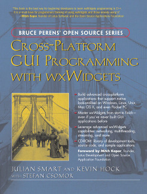

wxWidgets has its own 700-page book to help you learn or brush up on your
cross-platform programming skills. Written by Julian Smart and Kevin Hock with
Stefan Csomor, "Cross-Platform GUI Programming with wxWidgets" was published on
July 27th 2005 by Prentice Hall as part of Bruce Perens' Open Source Series.

The book comes packed with useful information and samples. The accompanying
CD-ROM contains source code, compilers and tools, and includes DialogBlocks, a
powerful dialog editor for Windows, Linux and Mac OS X which will also help you
compile your applications and wxWidgets itself.

  

    

      "Cross-Platform GUI Programming with wxWidgets is the best way for beginning
      developers to learn wxWidgets programming in C++, and is a valuable resource
      for experienced wxWidgets programmers looking to expand their skills. This
      book is a must-have both for programmers thinking of using wxWidgets and for
      those already using it."
    

    
Mitch Kapor, founder of Lotus Software and the Open Source Applications Foundation

  

**Please note**: From feedback we're getting, it's easy to miss the setup
instructions in Appendix B and Appendix C that tell you how to build your own
applications using popular compilers. In particular, you should find that
DialogBlocks (included on the accompanying CD-ROM) is a quick way to get
started, compiling both the wxWidgets library and your own first wxWidgets
applications.

## Where to Buy

  
  <a class="btn btn-lg btn-block btn-primary mt-2" href="http://www.amazon.com/gp/product/0131473816">Buy on Amazon.com</a>

The wxWidgets book is available to be read online by subscribing to
[Safari Books Online][2].

[2]: http://www.safaribooksonline.com/

In addition to Amazon, the book can be ordered from:

* [Blackwell's](http://www.blackwell.co.uk/), UK
* [Barnes and Noble](http://www.barnesandnoble.com/), US

We will be monitoring where else the book is available. The authors do not
currently sell the book directly.

Thank you for your support!

## Chapter Summary

**Chapter 1: Introduction**

What is wxWidgets, and why use it? A brief history; the wxWidgets community;
the license; wxWidgets ports and architecture explained.

**Chapter 2: Getting started**

A small wxWidgets sample: the application class; the main window; the event
table; an outline of program flow.

**Chapter 3: Event handling**

Event tables and handlers; how a button click is processed; skipping events;
pluggable and dynamic event handlers; defining custom events; window
identifiers.

**Chapter 4: Window basics**

The main features of a window explained; a quick guide to the commonest window
classes; base window classes such as wxWindow; top-level windows; container
windows; non-static controls; static controls; menus; control bars.

**Chapter 5: Drawing and printing**

Device context principles; the main device context classes described; buffered
drawing; drawing tools; device context drawing functions; using the printing
framework; 3D graphics with wxGLCanvas.

**Chapter 6: Handling input**

Handling mouse and mouse wheel events; handling keyboard events; keycodes;
modifier key variations; accelerators; handling joystick events.

**Chapter 7: Window layout using sizers**

Layout basics; sizers introduced; common features of sizers; programming with
sizers. Further layout issues: dialog units; platform-adaptive layouts; dynamic
layouts.

**Chapter 8: Using standard dialogs**

Informative dialogs such as wxMessageBox and wxProgressDialog; file and
directory dialogs such as wxFileDialog; choice and selection dialogs such as
wxColourDialog and wxFontDialog; entry dialogs such as wxTextEntryDialog and
wxFindReplaceDialog; printing dialogs: wxPageSetupDialog and wxPrintDialog.

**Chapter 9: Creating custom dialogs**

Steps in creating a custom dialog; an example: PersonalRecordDialog; deriving a
new class; designing data storage; coding the controls and layout; data
transfer and validation; handling events; handling UI updates; adding help;
adapting dialogs for small devices; further considerations in dialog design;
using wxWidgets resource files; loading resources; using binary and embedded
resource files; translating resources; the XRC format; writing resource
handlers; foreign controls.

**Chapter 10: Programming with images**

Image classes in wxWidgets; programming with wxBitmap; programming with wxIcon;
programming with wxCursor; programming with wxImage; image lists and icon
bundles; customizing wxWidgets graphics with wxArtProvider.

**Chapter 11: Clipboard and drag and drop**

Data objects; data source duties; data target duties; using the clipboard;
implementing drag and drop; implementing a drag source; implementing a drop
target; using standard drop targets; creating a custom drop target; more on
wxDataObject; drag and drop helpers in wxWidgets.

**Chapter 12: Advanced window classes**

wxTreeCtrl; wxListCtrl; wxWizard; wxHtmlWindow; wxGrid; wxTaskBarIcon; writing
your own controls; the control declaration; defining a new event class;
displaying information; handling input; defining default event handlers;
implementing validators; implementing resource handlers; determining control
appearance.

**Chapter 13: Data structure classes**

Why not STL? wxString; wxStringTokenizer; wxRegEx; wxArray; wxList; wxHashMap;
dates and times; wxObject; wxLongLong; wxPoint and wxRealPoint; wxRect;
wxRegion; wxSize; wxVariant.

**Chapter 14: Files and streams**

wxFile and wxFFile; wxTextFile; wxTempFile; wxDir; wxFileName; file functions;
file streams; memory and string streams; data streams; socket streams; filter
streams; zip streams; virtual file systems.

**Chapter 15: Memory management, debugging and error checking**

Creating and deleting window objects; creating and copying drawing objects;
initializing your application object; cleaning up your application; detecting
memory leaks and other errors; facilities for defensive programming; error
reporting; providing run-time type information; using wxModule; loading dynamic
libraries; exception handling; debugging tips.

**Chapter 16: Writing international applications**

Introduction to internationalization; providing translations; using message
catalogs; using wxLocale; character encodings and Unicode; converting data;
help files; numbers and dates; other media; an example.

**Chapter 17: Writing multithreaded applications**

When to use threads, and when not to; using wxThread; thread creation; starting
the thread; how to pause a thread or wait for an external condition;
termination; synchronization objects; wxMutex; deadlocks; wxCriticalSection;
wxCondition; wxSemaphore; the wxWidgets thread sample; alternatives to
multithreading: wxTimer, idle time processing, and yielding.

**Chapter 18: Programming with wxSocket**

Socket classes and functionality overview; introduction to sockets and basic
socket processing; the client; the server; connecting to a server; socket
events; socket status and error notifications; sending and receiving socket
data; creating a server; socket event recap; socket flags; blocking and non-
blocking sockets in wxWidgets; how flags affect socket behavior; using wxSocket
as a standard socket; using socket streams; alternatives to wxSocket.

**Chapter 19: Working with documents and views**

Document/view basics; choosing an interface style; creating and using frame
classes; defining your document and view classes; defining your window classes;
using wxDocManager and wxDocTemplate; other document/view capabilities;
standard identifiers; printing and previewing; file history; explicit document
creation; strategies for implementing undo/redo.

**Chapter 20: Perfecting your application**

Single instance versus multiple instances; modifying event handling; reducing
flicker; using a help controller; extended wxWidgets HTML help; authoring help;
other ways to provide help; parsing the command line; storing application
resources; invoking other applications; launching documents; redirecting
process input and output; managing application settings; application
installation on Windows, Linux and Mac OS X; following UI design guidelines.

**Appendix A: Installing wxWidgets**

Downloading and unpacking wxWidgets; configuration/build options; Windows -
Microsoft Visual Studio and VC++ command-line; Windows - Borland C++; Windows -
MinGW with and without MSYS; Unix/Linux and Mac OS X - GCC; customizing
setup.h; rebuilding after updating wxWidgets files; using "contrib" libraries.

**Appendix B: Building your own wxWidgets applications**

Windows - Microsoft Visual Studio; Linux - KDevelop; Mac OS X - Xcode;
makefiles; cross-platform builds using Bakefile; wxWidgets symbols and headers;
using wx-config.

**Appendix C: Creating applications with DialogBlocks**

What is DialogBlocks? Installing and upgrading DialogBlocks; the DialogBlocks
interface; the sample project; compiling the sample; creating a new project;
creating a dialog; creating a frame; creating an application object; debugging
your application.

**Appendix D: Other features in wxWidgets**

Further window classes; ODBC classes; MIME types manager; network
functionality; multimedia classes; embedded web browsers; accessibility; OLE
automation; renderer classes; event loops.

**Appendix E: Third-party tools for wxWidgets**

Language bindings such as wxPython and wxPerl; tools such as wxDesigner,
DialogBlocks and poEdit; add-on libraries such as wxMozilla, wxCURL,
wxPropertyGrid.

**Appendix F: wxWidgets application showcase**

Descriptions of notable wxWidgets applications, such as AOL Communicator and
Audacity.

**Appendix G: Using the CD-ROM**

Browsing the CD-ROM; the CD-ROM contents.

**Appendix H: How wxWidgets processes events**

An illustrated description of how event processing works.

**Appendix I: Event classes and macros**

A summary of the important event classes and macros.

**Appendix J: Code Listings**

Code listings for the PersonalRecordDialog and the wxWizard examples.

**Appendix K: Porting from MFC**

General observations; application initialization; message maps; converting
dialogs and other resources; documents and views; printing; string handling and
translation; database access; configurable control bars; equivalent
functionality by macros and classes.

## The CD-ROM Contents

The acommpanying CD-ROM contains the following:

* **wxWidgets 2.6.1**: wxWidgets source code for Windows, Linux, Mac OS X and
  more platforms.
* **Sample Code**: Browse the samples and code snippets from the book, using an
  HTML interface.
* **Bonus Sample**: The CD also contains a 'bonus' sample, a little image
  viewer application called Riffle with source and binaries for four platforms:
  Windows, Linux, Mac OS X, and Pocket PC 2003. The sample has scripts to
  create installations for all four platforms, which you can adapt for your own
  applications.
* **DialogBlocks Personal Edition**: Compile wxWidgets and the samples easily
  with [DialogBlocks Personal Edition][3], a version of the sophisticated
  dialog editor from Anthemion Software Ltd., for personal use. Binaries are
  supplied for Windows, Linux and Mac OS X.
* **Windows Compilers**: The following Windows compilers are supplied, and all
  may be used to compile wxWidgets (using DialogBlocks or other means).
  * [OpenWatcom C++][4] 1.3. Maintained by SciTech Software Inc., Sybase and
    the open source community, OpenWatcom C++ has everything required for
    building Windows applications.
  * [MinGW](http://www.mingw.org/) 3.1.0-1
  * [Digital Mars C++](http://www.digitalmars.com/)

[3]: http://www.dialogblocks.com/
[4]: http://www.openwatcom.org/

## Examples

You can download the examples from [here][5] (9.6 MB).

[5]: http://www.anthemion.co.uk/wxWidgetsBook/wxbookexamples.zip

## Errata

Please see the [errata page](/docs/book/errata/).
