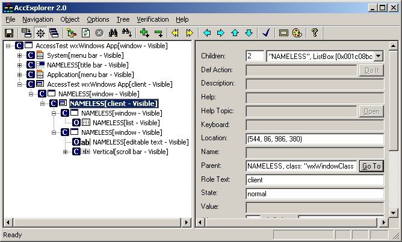
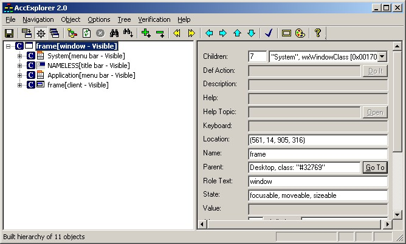
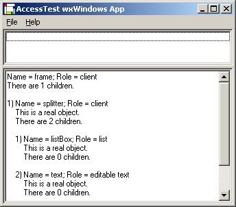

by Julian Smart, February 2003

## The Requirement for Accessibility

Increasingly, vendors and public organisations are required to ensure that
their software conforms to [Section 508][sec508] of the Rehabilitation Act
(USA). This means that disabled users (for example, blind or partially sighted
users) should be able to use the software. Of course, this is a good goal for
wxWidgets and its users, even without the legislation.

On Microsoft Windows, this essentially means support for the
[Active Accessibility API][msaa] (MSAA). Although a framework cannot do
everything that is needed for an application to be AA conformant, it can
provide the extra support to make this task relatively straightforward.

An interesting potential additional benefit of providing accessibility support
is the ability to use the API for automation of wxWidgets applications.

I am starting to add AA features to wxWidgets (in CVS head, 2.5.x series). The
rest of this document details the approach, progress made, and what has to be
done to complete it.

I am being funded to start the AA support by Dartmouth Medical School. However
I will need input from others to solve implementation problems. So if you're
interested in this aspect, please join in!

[sec508]: http://www.section508.gov/index.cfm?FuseAction=Content&ID=11
[msaa]: http://www.microsoft.com/enable/

## Approach and Design

I have taken a simple overall approach, which has been taken by other
frameworks and applications (for example Mozilla and Qt). This is to base
support around MSAA, and assume that support on other platforms will be fairly
similar. Abstracting and broadening the API (if necessary) can come later once
we have demonstrated the feasibility on Windows, which is the most urgent
platform.

Since I am working on Windows 2000, I am addressing MSAA version 1.3. We can
extend it to version 2.0 later, which means supporting dynamic annotation and
text services. MSAA 2.0 can only be used on XP, Windows 98, and Windows NT 4.

The main new class of interest is wxAccessible, which is the platform-
independent equivalent of MSAA's IAccessible. wxAccessible for each platform
derives from wxAccessibleBase, which contains virtual functions such as
_GetChild_, _GetChildCount_, _Navigate_ which the framework will call and
convert to data that the underlying system (such as MSAA on WIN32) can process.
There will eventually be a wxAccessible-derived class for every wxWidgets
window class or group of window classes, and an application writing a custom
window should provide their own wxAccessible-derived class.

wxWindowBase now has a virtual function called _CreateAccessible_ which each
window can override to create a new wxAccessible-derived object.
_GetOrCreateAccessible_ gets or creates an accessible, and you can call
_SetAccessible_ to set the accessible for a window, though this is normally
done automatically if you pass a wxWindow argument to the wxAccessible
constructor.

When MSAA requires an accessible object, a WM_GETOBJECT message is sent to the
window, and wxWidgets handles this by passing the wxAccessible object
associated with the window (creating one if necessary).

For functions that the wxWidgets application declines to implement, and if the
object represents a standard WIN32 control, the behaviour is handled instead by
a standard IAccessible object obtained using CreateStdAccessibleObject.

These are the relevant source files:

    include/wx/access.h          ; The accessibility classes and definitions
    include/wx/window.h          ; Declares wxWindowAccessible
    include/wx/msw/ole/access.h  ; wxAccessible declaration

    src/common/accesscmn.cpp     ; Currently empty
    src/common/wincmn.cpp        ; Implementation of wxWindowAccessible
    src/msw/window.cpp           ; WM_GETOBJECT implementation
    src/msw/access.cpp           ; Implements IAccessible, wxAccessible etc.

    samples/access               ; A sample to demonstrate accessibility support

## Compiling wxWidgets for Accessibility

To compile wxWidgets with accessibility support, set wxUSE_ACCESSIBILITY to 1
in wx/msw/setup.h. Only VC++ 6 has been tested so far. For samples other than
'access', you will need to add oleacc.lib to your project file to avoid link
errors. Also, I found I had to add !defined(_MSC_VER) to the test involving
__WXDEBUG__ and __MINGW32__ at the top of include/wx/datetime.h, and also make
sure the line:

    const long wxDateTime::TIME_T_FACTOR = 1000l;

is _always_ compiled, otherwise I got wxDateTime-related link errors. This
issue needs to be resolved.

If you need to temporarily disable accessibility for a wxWidgets app, simply
comment out the code that handles WM_GETOBJECT in window.cpp and recompile this
file. This will make MSAA handle accessibility for all windows itself.

## The Sample

The directory samples/access contains a simple accessibility sample,
AccessTest, that creates a splitter window and two controls (a listbox and a
text control). A menu item 'Query' uses client-side accessibility code to query
the accessibility hierarchy.

You can use tools from the MSAA development kit to look at the accessibility
hierarchy. Unfortunately, they produce rather different results. Accessible
Explorer fails to find the splitter window child of the frame's client area
when you show the hierarchy starting from the frame. However, when you select
the controls in AccessTest, it shows information about them; but it fails to
navigate up the hierarchy properly when you click on 'Go to parent'.

On the other hand, using the Active Accessibility Object Inspector, you can
navigate to the splitter window from the frame's client, and from there to the
child controls. Similar, the MSAAVeri application shows the full tree, and the
Narrator application (Programs/Accessories/Accessibility/Narrator) also seems
to work fine.

The following images show problems with the current implementation that will
need to be resolved.

Above, Accessible Explorer exploring AccessTest compiled _without_
accessibility features. Note how the full hierarchy is shown.

Above, Accessible Explorer exploring AccessTest compiled _with_ accessibility
features. Note how the splitter window and windows under it are not found.

Above, AccessTest showing that it can traverse its own accessibility
information using client-side code.

## Problems to be Solved

The most pressing problem is how to get Accessible Explorer to recognise the
hierarchy. Is it expecting our objects to enumerate their children? Supporting
IEnumVARIANT is not essential, according to the guidelines, and there are at
least two other ways to get child information (get_accChild and accNavigate).

If source for Accessible Explorer is available, it would help us know what it's
expecting to find. Unfortunately only the source for Inspector seems to be
provided, and that has less trouble with our implementation.

A fundamental question I have about AA is the relationship between windows and
clients. If you explore, say, the version of AccessTest without explicit
accessibility support, you find that some windows have a single child,
'client'. Are we supposed to model this relationship explicitly? In which case,
our GetParent/GetChild assumptions are wrong, since they return wxAccessible
objects which represents a whole window, not the window/client parts
separately. Should a window's role always be 'client', or 'window'?

All help with this will be very gratefully received!

## Further Implementation

We need to support events (so accessible objects can notify clients when a
state has changed).

We need to write appropriate wxAccessible classes for wxWidgets windows that
are not already supported by MSAA. For example, the splitter window should
allow the sash to be accessible, as well as its one or two visible children.

We need to document the API and write a topic overview.

We should also look at supporting AA 2.0 features, and investigate GTK+/Gnome
and Mac accessibility. We can perhaps provide a generic client/server
implementation of accessibility for platforms that don't support a standard:
for example we can have a TCP/IP server responding to client requests to access
the wxAccessible hierarchy.

## References

* [Using Mnemonics](/docs/tutorials/using-mnemonics/): An article contributed
  by AOL describing mnemonics (for executing commands via the keyboard).
* [Section 508](http://www.section508.gov/index.cfm?FuseAction=Content&ID=11)
  of the Rehabilitation Act (USA)
* [Active Accessibility Home Page](http://www.microsoft.com/enable/)
* [MSDN page on AA](http://msdn.microsoft.com/library/default.asp?url=/nhp/Default.asp?contentid=28000544)
* [Mozilla accessibility implementation](http://lxr.mozilla.org/seamonkey/source/accessible)
* [Implementing an MSAA server](http://www.mozilla.org/projects/ui/accessibility/msaa-server-impl.html)
* [Mozilla Accessibility Architecture](http://www.mozilla.org/projects/ui/accessibility/accessible-architecture.html)
* [The GNOME accessibility project](http://developer.gnome.org/projects/gap/)
* [GNOME accessibility for developers](http://developer.gnome.org/projects/gap/guide/gad/index.html) (draft)
* [microsoft.public.enable.developer](news:microsoft.public.enable.developer):
  very sparse official newsgroup for AA
* [JAWS screenreader](http://www.freedomscientific.com/fs_products/software_jaws.asp)

See also the samples in the MSAA SDK (all client code unfortunately), and the
IAccessible documentation in VC++. There is very little extra information about
AA on the web or newsgroups as far as I can see.

Some observations gleaned from the web:

"Active Accessibility weirdness note: You will probably want to use
AccessibleChildren() instead of get_accChildCount() and get_accChild().
AccessibleChildren probably calls those and then improves the results. But,
AccessibleChildren frequently returns fewer children than get_accChildCount
says it should.

Active Accessibility weirdness note: Some objects report 1 child with
AccessibleChildren, yet accNavigate reveals more children."
