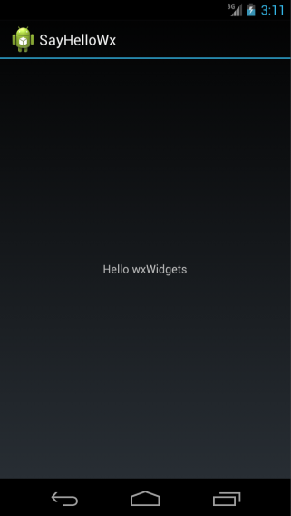

If you are interested in participating in the Google Summer of Code program
with wxWidgets, we have prepared a list of some potential projects you could
work on below. Please see our [main Summer of Code page](/gsoc/) for details
on how to apply.

Please notice that this list is always being updated, and also, that it is not
exclusive. You can submit proposals to work on projects which are not
listed here -- but please post to
[wx-dev mailing list](http://groups.google.com/group/wx-dev) to discuss them
first if you plan to do it.

The projects are sorted roughly in order of their [importance](/gsoc/project-ratings):

* **[wxAndroid](#android):** Start the work on a port to Android.
* **[wxiOS](#ios):** Continue the porting project started during GSoC 2011.
* **[wxUniv](#universal):** Bring the wxUniv port up to current wxWidgets
  standards.
* **[wxWebView Chromium](#webview-chromium):** Integrate and extend the
  Chromium backend for [wxWebView][].
* **[wxWebView Help](#webview-help):** Relace wxHTML with [wxWebView][] for
  wxHelpController.
* **[wxWebView Javascript](#webview-js):** Build an API around [wxWebView][]
  for integration with JavaScript events and values.
* **[General wxWebView Improvements](#webview-general):** Build features for
  [wxWebView][] to configure JS, plugins, and printing across all backends.
* **[Direct2D-based wxGraphicsContext](#gc-d2d):** Provide an implementation of
  [wxGraphicsContext][] for Windows using [Direct2D][].
* **[Power Management](#power-management):** Cross platform support for power
  management events.
* **[Cross Platform Animation](#animation):** Finish the implementation of the
  animation API started during GSoC 2011.
* **[Cross Platform System Sound](#sound):** Provide a way to play various
  "system sounds".
* **[Windows 7 Taskbar](#win7-taskbar):** Add support for various advanced
  taskbar features available since Windows 7.
* **[wxAUI Native Art Providers](#aui-native-art):** Make wxAUI blend in better
  with native rendering methods on each platform.
* **[wxRichTextCtrl Table UI](#rtc-table):** UI for creating and modifying
  tables in [wxRichTextCtrl][].
* **[wxRichTextCtrl RTL Support](#rtc-rtl):** Support right-to-left languages
  in [wxRichTextCtrl][].
* **[wxRichTextCtrl Text selection](#rtc-selection):** Text selection
  improvements in [wxRichTextCtrl][].
* **[Justified text alignment](#rtc-justified):** Justified text alignment in
  [wxRichTextCtrl][].
* **[wxFileSystem](#filesystem):** Improve our virtual file system abstraction.

[wxWebView]: http://docs.wxwidgets.org/trunk/classwx_web_view.html
[wxGraphicsContext]: http://docs.wxwidgets.org/trunk/classwx_graphics_context.html
[Direct2D]: http://msdn.microsoft.com/en-us/library/windows/desktop/dd370987.aspx
[wxRichTextCtrl]: http://docs.wxwidgets.org/trunk/classwx_rich_text_ctrl.html

Alternatively, you could decide to select a project depending on your
background, so that if you are a...

* Windows programmer -- then you could help us with
  [Direct2D-based wxGraphicsContext](#gc-d2d)
* Linux hacker -- then you could be interested in cross-platform
  [power management](#power-management) or
  [system sound](#sound) projects.
* Mac guru -- then, in addition to the two projects above, you could be
  interested in [wxiOS](#ios).
* Mobile enthusiast -- then either [wxAndroid](#android) or
  [wxiOS](#ios) could be exciting for you.
* Web/JavaScript developer -- then you should have a look at one of
  [wxWebView](#webview) projects.
* Somebody else -- tell us what could be interesting for you!

## <i class="fa fa-lightbulb-o fa-fw"></i> Create minimally functional Android port.

	

The goal of this project would be to start a wxAndroid port, i.e. an
implementation of wxWidgets API targeting the Android OS. It is infeasible to
fully write such a port in the GSoC time frame, but we believe that a motivated
student could provide a good foundation for such port and, ideally, something
at least minimally working.

The plan is to start by implementing the low-level classes needed by all
wxWidgets applications, such as `wxApp`, `wxWindow`, `wxTopLevelWindow`,
`wxEventLoop` and a few others. Once this is done it should be possible to use
`wxGLCanvas` to write Android applications using OpenGL for their graphics.

The next step could be to either implement more low-level classes such as the
GDI classes (`wxDC` and/or `wxGraphicsContext` and `wxBrush`, `wxPen`,
`wxBitmap` or the corresponding `wxGraphicsBrush`, `wxGraphicsPen`,
`wxGraphicsBitmap`) and use the wxUniversal port for the GUI controls, or start
implementing the GUI controls using native equivalents. In any case, the
student definitely would _not_ be expected to fully finish this part.

The exact approach used needs to be discussed as it would depend on the
qualifications -- and also interest/motivations -- of a particular student.

[**Difficulty:**](../project-ratings) 8
[**Importance:**](../project-ratings) 9

### Experience needed

Some knowledge of the Android API would be definitely useful.

### See also

* [Android developer site](http://developer.android.com/)
* [wxAndroid wiki page](http://wiki.wxwidgets.org/WxAndroid)
* [wxiOS](#ios)

## <i class="fa fa-lightbulb-o fa-fw"></i> Improve wxiOS port

A previous GSoC project has created the basics of a wxWidgets port to iOS. The
task for this year would be to make this port really usable and complete the
missing parts.

In particular the [wxiOS branch][ios_branch], in which all the work had been
done up to now, would need to be merged into the mainline and all standard
controls would need to be implemented. Note that part of this project -- which
ideally should be done before submitting the proposal to work on it -- would
consist of building the existing wxiOS sources and ascertaining its current
state.

[ios_branch]: https://github.com/wxWidgets/wxWidgets/tree/SOC2011_WXIOS

[**Difficulty:**](../project-ratings) 7
[**Importance:**](../project-ratings) 8

### Experience needed

Familiarity of Cocoa/iOS.

### See also

* [iOS developer site](https://developer.apple.com/technologies/ios/)

## <i class="fa fa-lightbulb-o fa-fw"></i> Fix bugs and implement missing features in wxUniversal

wxUniversal is a special wxWidgets port which implements high-level GUI
controls using wxWidgets itself instead of wrapping the native toolkit as all
the other ports do. It is useful for platforms which don't have their own
native UI (such as e.g. [DirectFB](http://directfb.org/)) or those in which the
native UI is difficult to wrap (see the discussion of [wxAndroid](#android)
project).

Unfortunately wxUniversal hasn't got much attention for many years and the
changes elsewhere in wxWidgets have introduced quite a few bugs in it. Also
many relatively recent controls are not implemented.

The goal of this project would be to check the current wxUniv status in detail,
catalog the existing bugs and missing features and, based on this list, work on
fixing and implementing them.

[**Difficulty:**](../project-ratings) 7
[**Importance:**](../project-ratings) 6 (but more if wxUniv is used by wxAndroid)

### Experience needed

Some prior experience with wxWidgets would be helpful, as with any other
project, but no platform/toolkit-specific knowledge is needed for this task.

### See also

* [Incomplete list of wxUniv bugs](http://trac.wxwidgets.org/query?status=accepted&status=confirmed&status=infoneeded&status=infoneeded_new&status=new&status=portneeded&status=reopened&component=wxUniv+%28any+port%29&order=priority&col=id&col=summary&col=status&col=type&col=priority&col=milestone&col=component)

## <i class="fa fa-lightbulb-o fa-fw"></i> Integrate and extend the Chromium backend

This project involves integrating and extending the existing wxWebViewChromium
backend for wxWebView on all platforms. Although the port current runs on
Windows and only a small amount of work should be needed for Linux support
further work is needed for Mac integration. Porting the code to the CEF3 API
would also be highly beneficial. This project has the potential to provide a
uniform backend for all three major platforms, and potentially opens the way
for better Javascript integration.

[**Difficulty:**](../project-ratings) 6
[**Importance:**](../project-ratings) 7

### See also

* [wxWebViewChromium](https://github.com/steve-lamerton/wxWebViewChromium)
* [Chromium Embedded Framework](http://code.google.com/p/chromiumembedded/)
* [wxWebView](http://docs.wxwidgets.org/trunk/classwx_web_view.html)

## <i class="fa fa-lightbulb-o fa-fw"></i> Use wxWebView for wxHtmlHelpWindow

wxWidgets currently provides the wxHtmlHelpWindow class to display HTML help
files. However it uses the wxHtmlWindow class which only supports rendering a
limited subset of the HTML standard. This project would develop a new class
wxWebHelpWindow based on wxWebView to allow complex help pages to be viewed.
This would probably involve creating a new base class wxHelpWindowBase and then
the new wxWebHelpWindow class. Other improvements could include the ability to
use the wxAuiNotebook classes rather than wxNotebook to allow a better visual
fit with classes that make extensive use of wxAUI. An EPUB parser would be a
further useful addition.

[**Difficulty:**](../project-ratings) 5
[**Importance:**](../project-ratings) 6

### See also

* [wxHtmlHelpWindow](http://docs.wxwidgets.org/trunk/classwx_html_help_window.html)
* [wxWebView](http://docs.wxwidgets.org/trunk/classwx_web_view.html)

## <i class="fa fa-lightbulb-o fa-fw"></i> wxWebView Javascript Integration

wxWebView currently provides a simple RunScript function for running
Javascript. However in many cases it would be preferable have access to a
return value, or even to call C++ from the Javascript. This project would aim
to provide at least basic functionality for accessing Javascript values. An API
would be required that ensures uniform behaviour across the different backends.
Before applying for this project please contact the wx-dev mailing list as
further research is required.

[**Difficulty:**](../project-ratings) 8
[**Importance:**](../project-ratings) 8

### See also

* [wxWebView](http://docs.wxwidgets.org/trunk/classwx_web_view.html)

## <i class="fa fa-lightbulb-o fa-fw"></i> General Improvements for wxWebView

Although a solid base was created as a Summer of Code 2011 project there is
still much work that can be done to improve wxWebView and its associated
classes. Recommended areas to work on include ways to manage scripts (enabling
and disabling javascript etc) and plugins (enabling and disabling plugins e.g.
flash / java). Other areas of potential work include improving printing support
and support for proxies and authentication. It is expected that a number of
these areas would be improved as part of a project, ideally on all three
existing backends, whilst also keeping the new Chromium backend in mind. Please
post to wx-dev if you are interested in working on this so that work is not
duplicated.

[**Difficulty:**](../project-ratings) 5 (depends on project)
[**Importance:**](../project-ratings) 6

### See also

* [wxWebView](http://docs.wxwidgets.org/trunk/classwx_web_view.html)

## <i class="fa fa-lightbulb-o fa-fw"></i> Implement wxGraphicsContext using Direct2D

Currently, [wxGraphicsContext][] is implemented using GDI+ under Windows. GDI+
seems, unfortunately, to be abandoned by Microsoft and has a lot of problems
including generally very poor performance (as it is not hardware-accelerated at
all) and horrible text rendering, especially at small font sizes.

Since Windows 7 (and Vista with updates installed) another solution is available:
[Direct2D](http://msdn.microsoft.com/en-us/library/windows/desktop/dd370990.aspx).
This project would consist of implementing a new [wxGraphicsContext][] backend
using this new API, and its companion DirectWrite for the text output.

[**Difficulty:**](../project-ratings) 7
[**Importance:**](../project-ratings) 8

### Experience needed

Windows, COM (at a basic level), Direct2D itself would be great but can be
learned during the project.

## <i class="fa fa-lightbulb-o fa-fw"></i> Power management under non-Windows platforms

wxWidgets has support for
[power events](http://docs.wxwidgets.org/trunk/classwx_power_event.html) but
it's currently only implemented on Windows and doesn't work for Vista and
later systems right now, e.g. it's impossible to prevent the system from
suspending in this way (which was used until Windows XP) any more. The goal of
this project would be to update power management support for Windows Vista/7
(which is simple to do, see
[this thread](http://thread.gmane.org/gmane.comp.lib.wxwidgets.devel/120453))
and, most importantly, also implement them for Linux and/or OS X. This will
include devising an API which can be implemented on all platforms and actually
implementing it for Windows and at least one of Linux/OS X (and ideally both).

[**Difficulty:**](../project-ratings) 7 for either Linux or OS X, 8 if both
[**Importance:**](../project-ratings) 6

### Experience needed

Linux part will require the use of DBUS and/or DeviceKit so experience using
them would be handy. OS X part obviously would be easier with some prior
experience with this platform (foundation level) API.

### See also

* [Getting sleep notifications under OS X](http://developer.apple.com/library/mac/#qa/qa1340/_index.html)

## <i class="fa fa-lightbulb-o fa-fw"></i> Cross-platform animation support

Animations are becoming and more important in the modern UIs but are not yet
support by wxWidgets. The goal of this project would be to allow simple to use
cross-platform (including falling back to suppressing animations entirely on
the systems that don't support them) API for animating parts of the program UI.

This project has been started during [GSoC 2011](/gsoc/2011) but never brought
to completion. The goal would be to revisit the work done so far and finish
the implementation of it for Windows and Cocoa.

Notice that in 2011 there was no simple way to support animation with GTK+,
but if this has changed since then, working on GTK-specific implementation
would be welcome too and could replace Windows or Cocoa part of this work.

[**Difficulty:**](../project-ratings) 8
[**Importance:**](../project-ratings) 6

### Experience needed

Windows, Cocoa.

### More information

* [Windows Animation Manager](http://msdn.microsoft.com/en-us/library/windows/desktop/ee960255.aspx)
* [Animation Programming Guide for Cocoa](https://developer.apple.com/library/mac/#documentation/Cocoa/Conceptual/AnimationGuide/Introduction/Introduction.html)

## <i class="fa fa-lightbulb-o fa-fw"></i> Cross platform support for playing system sounds

wxWidgets provides a wxBell() function which is as simple as it gets and the
wxSound class which allows sound files to be played but requires the file (or
sound data) to be present and produces the same result under all platforms
(meaning that it won't sound good on any of them). The goal of this project
would be to provide a way to play various "system sounds" in a simple and
portable way and respecting the user settings (in particular, not play anything
at all if the sound effects are turned off).

[**Difficulty:**](../project-ratings) 5-7
[**Importance:**](../project-ratings) 5

Difficulty is 5 is for a minimal usable implementation, 7 for something
sufficiently powerful to represent libcanberra API while still being
implementable on the other platforms.

### See also

* [Windows example](http://www.codeproject.com/Articles/2740/Play-Windows-sound-events-defined-in-system-Contro) (not sure if this is the best way though)
* [OS X system sound reference](http://developer.apple.com/library/mac/#documentation/AudioToolbox/Reference/SystemSoundServicesReference/Reference/reference.html)
* [libcanberra](http://developer.gnome.org/libcanberra/) from Freedesktop, i.e. modern Linux systems.

### Experience needed

Experience with the platforms being targeted would be welcome.

## <i class="fa fa-lightbulb-o fa-fw"></i> Add support for Windows 7 taskbar features

Windows Vista/7 has added support for several new features to the task bar
which are all accessible via [ITaskbarList3 interface](http://msdn.microsoft.com/en-us/library/windows/desktop/dd391692%28v=vs.85%29.aspx):

- Overlays: [example](http://blogs.msdn.com/b/oldnewthing/archive/2013/02/11/10392502.aspx)
- Buttons: [example](http://blogs.msdn.com/b/oldnewthing/archive/2013/02/18/10394684.aspx)
- Progress display
- Custom, possibly live, thumbnails: [example](http://blogs.msdn.com/b/oldnewthing/archive/2013/02/25/10396638.aspx)
- More control over grouping: [example](http://blogs.msdn.com/b/oldnewthing/archive/2012/08/17/10340743.aspx)
- Jump lists.

None of these features have equivalents under the other platforms,
unfortunately, but it would be nice to be able to make use of them at least
under Windows.

[**Difficulty:**](../project-ratings) 5
[**Importance:**](../project-ratings) 4

### Experience needed

Windows, COM (at a basic level).

### More information

* [Getting Started](http://msdn.microsoft.com/en-us/library/windows/desktop/ee624070.aspx)

## <i class="fa fa-lightbulb-o fa-fw"></i> Implement more native art providers for wxAUI

The goal is to make wxAUI blend in better on a set of platforms, particularly
on Mac, GTK+ and Windows 7. The original wxAUI art is rather Windows XP-like
and it should be possible to take colours from the current theme and apply them
to wxAUI. Mostly this will be writing separate art provider classes, but
occasionally it may be necessary to dig deeper into the wxAUI code.

[**Difficulty:**](../project-ratings) 6
[**Importance:**](../project-ratings) 5

### Experience needed

No platform-specific experience is needed as the art provider should behave in
the same way under all platforms.

### See also

* The ribbon classes, implemented as a GSoC 2009 project, has customisable art
  and demonstrates a Vista/Windows 7-like art mode.

## <i class="fa fa-lightbulb-o fa-fw"></i> wxRichTextCtrl UI for editing tables

The [wxRichTextCtrl][] class now has text box and table capabilities, but there
is no user interface for creating and modifying tables. The goal of this
project is to analyze what's needed, looking at word processors such as
OpenOffice.org Writer, and implement the necessary dialogs and mouse
manipulation (for example table object selection and row/column movement).

## <i class="fa fa-lightbulb-o fa-fw"></i> Right-to-left languages support in wxRichTextCtrl

The goal is to support right-to-left languages such as Hebrew, including
support for composing individual diacritics from within [wxRichTextCtrl][].

### Experience needed

Good knowledge of Unicode would be helpful.

## <i class="fa fa-lightbulb-o fa-fw"></i> wxRichTextCtrl text selection improvements

The aim would be to replace the current text selecting mechanism with a more
precise one and more correct from a visual point of view. Currently text
selection is emphasized by creating separate chunks from the selected text and
paint them separated from the rest of the text. The drawback is that often
there is a displacement of few pixels affecting the selected text compared with
the unselected text. Things are even worse if the row contains Tab characters.
As the wxRTC uses double buffering, a proposal is to have the selection
emphasized by painting the area(s) underneath the selection with the intended
color (using `wxRichTextCtrl::PaintBackground()`?), then text above it just
painted normally (maybe using a logical function with the DC). A very nice
example is in the Drawing sample in "Text screen" (F2) - the text that says
"There should be a text below".

## <i class="fa fa-lightbulb-o fa-fw"></i> Justified text alignment in wxRichTextCtrl

This could be done in a simpler fashion by only distributing extra space
(between words, and if needed adjust character spacing) and no hyphenation, or
more complicated by including hyphenation. The base should be a good algorithm.
Special cases: last row of a paragraph, last character in a row, images. There
is a "famous" TeX implementation but unfortunately I couldn't find any good
references for it (try [Tex (Wiki)](http://en.wikipedia.org/wiki/TeX#Hyphenation_and_justification),
[Tex (by D.Knuth)](http://tex.loria.fr/tex-source/tex-source.html)).
Another good description can be found here: Adobe InDesign, Text and
Typography. A JavaScript implementation can be found here:
[TeX line breaking algorithm in Javascript](http://www.bramstein.com/projects/typeset/).

## <i class="fa fa-lightbulb-o fa-fw"></i> Clean up and improve wxFileSystem

[wxFileSystem](http://docs.wxwidgets.org/trunk/classwx_file_system.html)
currently suffers from several problems, mainly confusion between the file
names and file system URIs. The goal of this project would be to clean up and
streamline the existing code to clear this up and make it possible to extend it
further.

Notably, integration with the underlying OS-specific VFS facilities such as
[GVFS](http://developer.gnome.org/gio/unstable/GVfs.html) or
[KIO](http://api.kde.org/4.2-api/kdelibs-apidocs/kio/html/index.html) might be
an interesting idea.

This proposal is not finalized, please post to wx-dev if you're interested in
discussing it further.

[**Difficulty:**](../project-ratings) ?
[**Importance:**](../project-ratings) ?

### Experience needed

Nothing particular.
