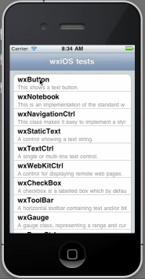
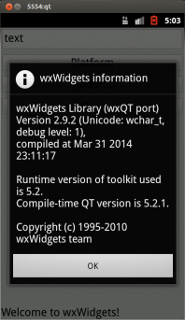
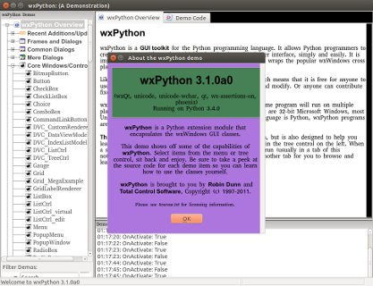

If you are interested in participating in the Google Summer of Code program
with wxWidgets, we have prepared a list of some potential projects you could
work on below. Please see our [main Summer of Code page](/gsoc/) for details
on how to apply.

Please notice that this list is not exclusive, ie that you can submit
proposals to work on projects which are not listed here -- but please post to
[wx-dev mailing list](http://groups.google.com/group/wx-dev) to discuss them
first if you plan to do this.

Notice that the projects are sorted roughly in order of their
[importance](/gsoc/project-ratings):

* **[wxiOS](#ios):** Continue the porting project started during GSoC 2011.
* **[Frozen grid columns/rows](#frozen-grid):** Add support for "freezing",
  i.e. fixing in place while the rest of the grid is scrolled, of rows or
  columns in [wxGrid][].
* **[Multi-touch gestures support](#multitouch):** Support for multi-touch
  gestures.
* **[Power Management](#power-management):** Cross platform support for power
  management events.
* **[Cross Platform System Sound](#sound):** Provide a way to play various
  "system sounds".
* **[Cross Platform Animation](#animation):** Finish the implementation of the
  animation API started during GSoC 2011.
* Several [wxWebView][]-related projects: 
    - **[Features switches](#webview-features):** Make [wxWebView][] more
      flexible to allow using it as a general purpose display control.
    - **[JavaScript API](#webview-js):** Build an API for integration with
      JavaScript events and values.
    - **[Cookies and Downloads](#webview-cookies-download):**  Add support for
      managing cookies and handling file downloads.
* **[wxRichTextCtrl RTL Support](#rtc-rtl):** Support right-to-left languages
  and BiDi in [wxRichTextCtrl][].
* **[wxAUI Native Art Providers](#aui-native-art):** Make wxAUI blend in better
  with native rendering methods on each platform.
* **[wxOpenGLGraphicsContext](#opengl-graphics-context):** Create a wxGraphicsContext
  renderer using OpenGL for drawing.
* **[wxQt](#qt):** Improve the port for Qt support under Linux/Android, targeting fully featured apps like wxPython Phoenix (see GSoC 2010 and 2014)

<!-- These wxRTC projects don't have enough details.

    - **[Text selection](#rtc-selection):** Text selection improvements in
      [wxRichTextCtrl][].
    - **[Justified text alignment](#rtc-justified):** Add support for justified
      text alignment to [wxRichTextCtrl][].
 -->

[wxGrid]: http://docs.wxwidgets.org/trunk/classwx_grid.html
[wxWebView]: http://docs.wxwidgets.org/trunk/classwx_web_view.html
[wxRichTextCtrl]: http://docs.wxwidgets.org/trunk/classwx_rich_text_ctrl.html

Alternatively, you could decide to select a project depending on your
background, so that if you are a...

<!-- * Windows programmer - no MSW projects currently -->
* Linux hacker -- then you could be interested in cross-platform
  [power management](#power-management) or
  [system sound](#sound) projects.
* Mac guru -- then, in addition to the two projects above, you could be
  interested in [wxiOS](#ios).
* Mobile enthusiast -- then [wxiOS](#ios) could be exciting for you.
* Web/JavaScript developer -- then you should have a look at one of
  wxWebView-related projects.
* Somebody else -- tell us what could be interesting for you!

## <i class="fa fa-lightbulb-o fa-fw"></i> Improve wxiOS port

	

A previous GSoC project has created the basics of a wxWidgets port to iOS. The
task for this year would be to make this port really usable and complete the
missing parts.

In particular the [wxiOS branch][ios_branch], in which all the work had been
done up to now, would need to be merged into the mainline and all standard
controls would need to be implemented. Note that part of this project -- which
ideally should be done before submitting the proposal to work on it -- would
consist of building the existing wxiOS sources and ascertaining its current
state.

[ios_branch]: https://github.com/wxWidgets/wxWidgets/tree/SOC2011_WXIOS

[**Difficulty:**](../project-ratings) 7
[**Importance:**](../project-ratings) 8

#### Potential mentors

Stefan Csomor, Václav Slavik

#### Experience needed

Familiarity with Cocoa/iOS.

#### See also

* [wxiOS test app video](http://www.youtube.com/watch?v=PTbFj9dqROs)
* [Current wxiOS sources](https://github.com/wxWidgets/wxWidgets/tree/SOC2011_WXIOS)
* [iOS developer site](https://developer.apple.com/technologies/ios/)

## <i class="fa fa-lightbulb-o fa-fw"></i> Implement support for frozen rows/columns in wxGrid

	

The goal is to implement support for freezing some rows or columns in
[wxGrid][], i.e. fixing them in place while allowing the rest of the grid
contents to scroll. At the very least, it should be possible to freeze a
single row at either top or bottom of the window, as this is commonly used to
implement header or footer rows, but ideally all possible combinations of
freezing single or multiple rows or columns at either side of the grid window
should be supported.

This is a difficult project as implementing this feature will require updating
the existing wxGrid code to deal with the consequences and it is not
impossible that relatively major changes in it would be required. On the other
side, wxGrid is entirely implemented in wxWidgets itself, so unlike almost all
the other projects in this list, this project can be implemented entirely
under a single platform.

[**Difficulty:**](../project-ratings) 8
[**Importance:**](../project-ratings) 7

#### Potential mentors

Vadim Zeitlin

#### Experience needed

No specific requirements.

## <i class="fa fa-lightbulb-o fa-fw"></i> Support multi-touch gestures

The goal of this project is to generate wxWidgets events for the multi-touch
gestures recognized by the underlying system and, possibly, also the raw
touches which compose them. But it's adding support for the high level events,
such as "zoom", "pan" or "rotate" which is the most important part of this
project.

Modern desktop systems all support sending such events but do it in different
ways, so the first part of this project will be to find a subset of events and
information carried by them sufficiently rich to be useful, yet also supported
by more than one, and ideally by all three, major platforms.

[**Difficulty:**](../project-ratings) 7
[**Importance:**](../project-ratings) 7

#### Potential mentors

Eric Jensen, Stefan Csomor

#### Experience needed

Ability to work with more than one platform is definitely required.

#### See also

* [Windows Touch Gestures Overview](http://msdn.microsoft.com/en-us/library/windows/desktop/dd940543.aspx)
* [Windows Gesture Message](http://msdn.microsoft.com/en-us/library/windows/desktop/dd353242.aspx)
* [OS X Gestures](https://developer.apple.com/library/mac/documentation/cocoa/conceptual/eventoverview/HandlingTouchEvents/HandlingTouchEvents.html)
* [GTK+ Gestures Library](https://launchpad.net/libgrip)

## <i class="fa fa-lightbulb-o fa-fw"></i> Power management under non-Windows platforms

wxWidgets has support for
[power events](http://docs.wxwidgets.org/trunk/classwx_power_event.html) but
it's currently only implemented on Windows and doesn't work for Vista and
later systems right now, e.g. it's impossible to prevent the system from
suspending in this way (which was used until Windows XP) any more. The goal of
this project would be to update power management support for Windows Vista/7
(which is simple to do, see
[this thread](http://thread.gmane.org/gmane.comp.lib.wxwidgets.devel/120453))
and, most importantly, also implement them for Linux and/or OS X. This will
include devising an API which can be implemented on all platforms and actually
implementing it for Windows and at least one of Linux/OS X (and ideally both).

[**Difficulty:**](../project-ratings) 7 for either Linux or OS X, 8 if both
[**Importance:**](../project-ratings) 6

#### Potential mentors

Paul Cornett, Stefan Csomor

#### Experience needed

Linux part will require the use of DBUS and/or DeviceKit so experience using
them would be handy. OS X part obviously would be easier with some prior
experience with this platform (foundation level) API.

#### See also

* [Getting sleep notifications under OS X](http://developer.apple.com/library/mac/#qa/qa1340/_index.html)

## <i class="fa fa-lightbulb-o fa-fw"></i> Cross-platform animation support

Animations are becoming and more important in the modern UIs but are not yet
supported by wxWidgets. The goal of this project would be to allow simple to
use cross-platform (including falling back to suppressing animations entirely
on the systems that don't support them) API for animating parts of the program
UI.

This project has been started during [GSoC 2011](/gsoc/2011) but never brought
to completion. The goal would be to revisit the work done so far and finish
the implementation of it for Windows and Cocoa.

Notice that in 2011 there was no simple way to support animation with GTK+,
but if this has changed since then, working on GTK-specific implementation
would be welcome too and could replace Windows or Cocoa part of this work.

[**Difficulty:**](../project-ratings) 8
[**Importance:**](../project-ratings) 6

#### Potential mentors

Bryan Petty

#### Experience needed

Windows, Cocoa.

#### More information

* [Windows Animation Manager](http://msdn.microsoft.com/en-us/library/windows/desktop/ee960255.aspx)
* [Animation Programming Guide for Cocoa](https://developer.apple.com/library/mac/#documentation/Cocoa/Conceptual/AnimationGuide/Introduction/Introduction.html)

## <i class="fa fa-lightbulb-o fa-fw"></i> Cross platform support for playing system sounds

wxWidgets provides a `wxBell()` function which is as simple as it gets and the
wxSound class which allows sound files to be played but requires the file (or
sound data) to be present and produces the same result under all platforms
(meaning that it won't sound good on any of them). The goal of this project
would be to provide a way to play various "system sounds" in a simple and
portable way and respecting the user settings (in particular, not play anything
at all if the sound effects are turned off).

[**Difficulty:**](../project-ratings) 5-7
[**Importance:**](../project-ratings) 5

Difficulty is 5 is for a minimal usable implementation, 7 for something
sufficiently powerful to represent libcanberra API while still being
implementable on the other platforms.

#### Potential mentors

Robin Dunn

#### Experience needed

Experience with the platforms being targeted would be welcome.

#### See also

* [Windows example](http://www.codeproject.com/Articles/2740/Play-Windows-sound-events-defined-in-system-Contro) (not sure if this is the best way though)
* [OS X system sound reference](http://developer.apple.com/library/mac/#documentation/AudioToolbox/Reference/SystemSoundServicesReference/Reference/reference.html)
* [libcanberra](http://developer.gnome.org/libcanberra/) from Freedesktop, i.e. modern Linux systems.

## <i class="fa fa-lightbulb-o fa-fw"></i> Make wxWebView more configurable

wxWebView currently works very well as a browser, but it lacks some features
to allow using it in other roles. For example, to use it for displaying HTML
messages in an email client, it must allow turning off support for JavaScript,
plugins, Java and even automatic image display as well as allowing
intercepting more events such as context menu building. We also need more
control over the use of cookies, file downloading etc.

The goal of this project would be to add the necessary API to allow for such
"controlled" use of wxWebView. Notice that ideally this would need to be done
for all three of the existing backends, ie Internet Explorer, WebKit and
Chromium, and at the very least for the first two.

[**Difficulty:**](../project-ratings) 5-7 (depending on the number of backends)
[**Importance:**](../project-ratings) 6

#### Potential mentors

Steven Lamerton, Vadim Zeitlin

#### Experience needed

Any experience with using `IID_IWebBrowser` and/or WebKit would be helpful.

#### See also

* [wxWebView](http://docs.wxwidgets.org/trunk/classwx_web_view.html)

## <i class="fa fa-lightbulb-o fa-fw"></i> wxWebView JavaScript Integration

wxWebView currently provides a simple `RunScript()` function for running
JavaScript. However in many cases it would be preferable have access to a
return value, or even to call C++ from the JavaScript. This project would aim
to provide at least basic functionality for accessing JavaScript values. An API
would be required that ensures uniform behaviour across the different backends.
Before applying for this project please contact the wx-dev mailing list as
further research is required.

[**Difficulty:**](../project-ratings) 8
[**Importance:**](../project-ratings) 7

#### Potential mentors

Steven Lamerton, Vadim Zeitlin

#### Experience needed

Minimal knowledge of JavaScript.

#### See also

* [SWIG JavaScript branch](https://github.com/oliver----/swig-v8/)
* [wxWebView](http://docs.wxwidgets.org/trunk/classwx_web_view.html)

## <i class="fa fa-lightbulb-o fa-fw"></i> wxWebView Cookies and Downloads

Currently wxWebView does not support cookies. This has been implemented as a
GTK+ specific patch, but this is not useful for a cross-platform library. The
idea here would be to implement a cross-platform API for this that supports at
least GTK+, Windows, and OSX - covering "the big three" platforms usually
required for new additions to wxWidgets.

Additionally, wxWebView has no way of managing file downloads. At a minimum, we
would require a download request event available to be tied into, but ideally
providing a full API for managing multiple downloads, and tracking status is
desired.

Considering how similar these two projects are, and the approximate time
required to implement both, the proposal here is to join both tasks into one
potential project for Summer of Code.

[**Difficulty:**](../project-ratings) 5-7 (depending on the number of backends)
[**Importance:**](../project-ratings) 6

#### Potential mentors

Steven Lamerton, Bryan Petty, Stefano Mtangoo

#### Experience needed

Any experience with using `IID_IWebBrowser` and WebKit would be helpful.

#### See also

* [Cookie Patch on Trac](http://trac.wxwidgets.org/ticket/14528)
* [Download with WebkitGTK](http://stackoverflow.com/questions/11360453/how-to-download-with-gtk-webkit-and-webkitwebview)
* [Download With IWebBrowser](http://stackoverflow.com/questions/13754185/custom-download-manager-iwebbrowser2)

## <i class="fa fa-lightbulb-o fa-fw"></i> Right-to-left languages support in wxRichTextCtrl

The goal is to support right-to-left languages such as Hebrew, including
support for composing individual diacritics from within [wxRichTextCtrl][].

This will also require improving support for the entry of Unicode characters
in wxWidgets globally, ie adding events for various IME actions and so would
be useful even for the programs not using wxRichTextCtrl.

[**Difficulty:**](../project-ratings) 8
[**Importance:**](../project-ratings) 7

#### Potential mentors

Julian Smart, Vadim Zeitlin

#### Experience needed

Good knowledge of Unicode and BiDi would be helpful. Knowledge of IME under
different platforms is also needed.

<!--

## <i class="fa fa-lightbulb-o fa-fw"></i> wxRichTextCtrl text selection improvements

The aim would be to replace the current text selecting mechanism with a more
precise one and more correct from a visual point of view. Currently text
selection is emphasized by creating separate chunks from the selected text and
paint them separated from the rest of the text. The drawback is that often
there is a displacement of few pixels affecting the selected text compared with
the unselected text. Things are even worse if the row contains Tab characters.
As wxRichTextCtrl uses double buffering, a proposal is to have the selection
emphasized by painting the area(s) underneath the selection with the intended
color (using `wxRichTextCtrl::PaintBackground()`?), then text above it just
painted normally (maybe using a logical function with the DC). A very nice
example is in the Drawing sample in "Text screen" (F2) - the text that says
"There should be a text below".

## <i class="fa fa-lightbulb-o fa-fw"></i> Justified text alignment in wxRichTextCtrl

This could be done in a simpler fashion by only distributing extra space
(between words, and if needed adjust character spacing) and no hyphenation, or
more complicated by including hyphenation. The base should be a good algorithm.
Special cases: last row of a paragraph, last character in a row, images. There
is a "famous" TeX implementation but unfortunately I couldn't find any good
references for it (try [Tex (Wiki)](http://en.wikipedia.org/wiki/TeX#Hyphenation_and_justification),
[Tex (by D.Knuth)](http://tex.loria.fr/tex-source/tex-source.html)).
Another good description can be found here: Adobe InDesign, Text and
Typography. A JavaScript implementation can be found here:
[TeX line breaking algorithm in JavaScript](http://www.bramstein.com/projects/typeset/).

-->

## <i class="fa fa-lightbulb-o fa-fw"></i> Native art providers for wxAUI

The goal is to make wxAUI blend in better on a set of platforms, particularly
on Mac, GTK+ and Windows 7. The original wxAUI art is rather Windows XP-like
and it should be possible to take colours from the current theme and apply them
to wxAUI. Mostly this will be writing separate art provider classes, but
occasionally it may be necessary to dig deeper into the wxAUI code.

[**Difficulty:**](../project-ratings) 6
[**Importance:**](../project-ratings) 5

#### Potential mentors

Bryan Petty

#### Experience needed

No platform-specific experience is needed as the art provider should behave in
the same way under all platforms.

#### See also

* The ribbon classes, implemented as a GSoC 2009 project, has customisable art
  and demonstrates a Vista/Windows 7-like art mode.
* [wxRendererNative documentation](http://docs.wxwidgets.org/trunk/classwx_renderer_native.html)

## <i class="fa fa-lightbulb-o fa-fw"></i> wxOpenGLGraphicsContext

The goal is to create a wxGraphicsContext implementation that uses OpenGL for
(2D) drawing.

Advantages over current wxGraphicsContext renderers would be hardware
accelerated and consistent output on all three major platforms (Windows, Linux,
OS X).

[**Difficulty:**](../project-ratings) 6
[**Importance:**](../project-ratings) 5

#### Potential mentors

Eric Jensen, Manuel Martin

#### Experience needed

wxWidgets, OpenGL

#### See also

* [wxGraphicsContext documentation](http://docs.wxwidgets.org/trunk/classwx_graphics_context.html)
* [wxGraphicsRenderer documentation](http://docs.wxwidgets.org/trunk/classwx_graphics_renderer.html)
* [wxDirect2D Implementation Progress](https://github.com/alexpana/wxWidgets/wiki/Direct2D-Implementation-Progress)

## <i class="fa fa-lightbulb-o fa-fw"></i> Improve wxQt port

  

    
  

  

    
  

Previous [GSoC 2010](/gsoc/2010) & [GSoC 2014](/gsoc/2014) projects (plus several 
major contributions) had created an experimental wxWidgets port using Qt, 
initially targeted to simple applications.
The task for this year would be to advance & complete the missing parts, so it is 
would be capable to run seamlessly fully featured applications 
(like [wxPython][wx_python]) under Linux and Android too.

The [wxQt port][wxqt_port] has been already merged into the mainline with most of the 
standard controls implemented, but it need some maintenance due minor changes in 
wxWidgets and Qt, along with other possible low-level improvements (i.e. event loop).

There is a pending [Pull Request][wxqt_patches] needing attention, that would be
a great starting point to begin with, in order to fix known issues and ascertain 
the project's current state --ideally should be done before submitting the proposal--.

Also, there are some miscellaneous controls, dialogs and major features missing
(including printing framework, drag and drop, etc.), see [wxQt Status][wxqt_status].

This is a ambitious project at this stage, so expect to learn a lot about technical 
topics like low-level multi-platform support, core desktop and mobile applications 
development, deep C++ programming concepts, toolkit internals, etc.

For a complete list of tentative pending issues and initial instructions see the initial
[Android Proof of Concept][wxqt_android_poc] and [GSoC 2014 repository][gsoc2014_repo].

[wxqt_port]: https://wiki.wxwidgets.org/WxQt
[wxqt_status]: https://wiki.wxwidgets.org/WxQt/Status
[wxqt_patches]: https://github.com/wxWidgets/wxWidgets/pull/319
[wx_python]: https://wxpython.org/
[wxqt_android_poc]: https://github.com/reingart/gsoc2014
[gsoc2014_repo]: https://github.com/reingart/wxWidgets

[**Difficulty:**](../project-ratings) 8
[**Importance:**](../project-ratings) 5

#### Potential mentors

Mariano Reingart (prior GSoC student)

#### Experience needed

Familiarity with Qt, Linux, Android and optionally wxPython.

#### See also
 * [wxQt Ubuntu notes](https://github.com/reingart/wxWidgets/wiki/WxQtUbuntuNotes)
 * [wxQt Andoid notes](https://github.com/reingart/wxWidgets/wiki/WxQtAndroidNotes)
 * [wxPython Phoenix notes](https://github.com/reingart/wxWidgets/wiki/wxPythonQtPhoenixNotes)
